! Installing Apache

sudo apt update

sudo apt install apache2

sudo systemctl status apache2

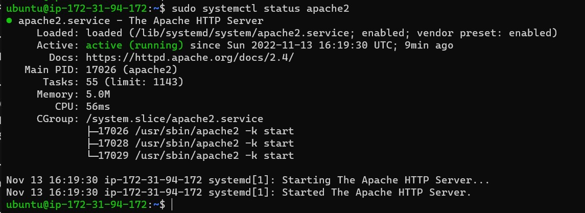

[install openssh](https://learn.microsoft.com/en-us/windows-server/administration/openssh/openssh_install_firstuse?tabs=powershell)

[generate openssh key](https://learn.microsoft.com/en-us/windows-server/administration/openssh/openssh_keymanagement)

! Create 2 inbound rules on AWS EC2 instance

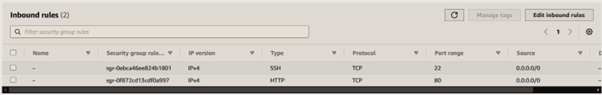

! Visit the public address on a web browser

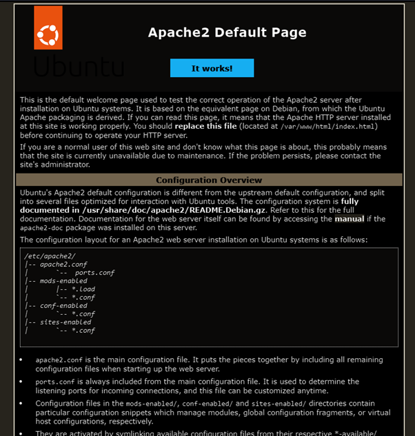
 

! Installing MYSQL
sudo apt install mysql-server
sudo mysql

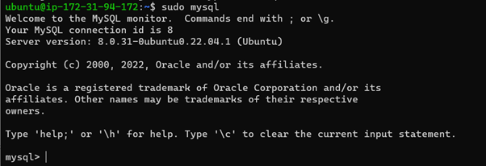
 

! Change the mysql root user password
ALTER USER 'root'@'localhost' IDENTIFIED WITH mysql_native_password BY 'PassWord.1';

! Run script to secure mysql
sudo mysql_secure_installation

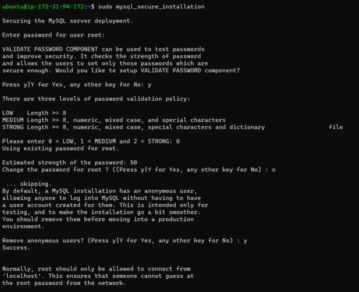

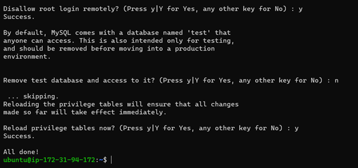
 
 

! Check msql root access
sudo mysql -p

 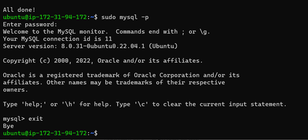
 

! Installing PHP
sudo apt install php libapache2-mod-php php-mysql

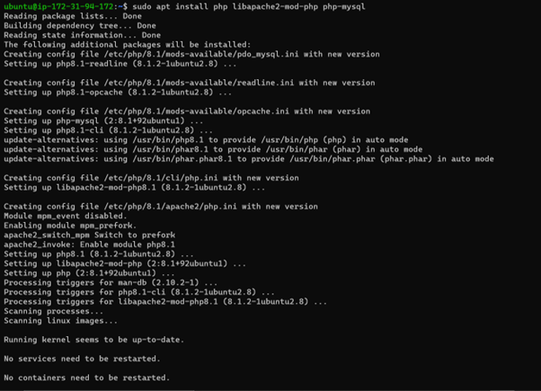
 
! Confirm installation
php -v

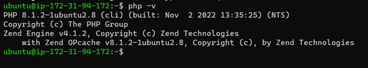
 

! Create a virtual host for your website using Apache

! Create a directory called projectlamp
sudo mkdir /var/www/projectlamp

! Assign ownership to directory
 sudo chown -R $USER:$USER /var/www/projectlamp

! create a configuraton file called projectlamp.conf with the text below and save
<VirtualHost *:80>
    ServerName projectlamp
    ServerAlias www.projectlamp 
    ServerAdmin webmaster@localhost
    DocumentRoot /var/www/projectlamp
    ErrorLog ${APACHE_LOG_DIR}/error.log
    CustomLog ${APACHE_LOG_DIR}/access.log combined
</VirtualHost>

sudo vi /etc/apache2/sites-available/projectlamp.conf
sudo ls /etc/apache2/sites-available

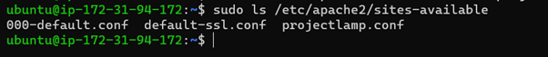
 
! Enable virtual host
sudo a2ensite projectlamp
sudo a2dissite 000-default
sudo apache2ctl configtest
sudo systemctl reload apache2
sudo echo 'Hello LAMP from hostname' $(curl -s http://169.254.169.254/latest/meta-data/public-hostname) 'with public IP' $(curl -s http://169.254.169.254/latest/meta-data/public-ipv4) > /var/www/projectlamp/index.html

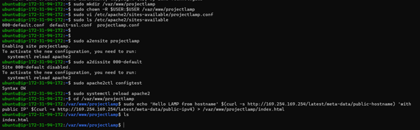
 
! check browser address
http://<Public-IP-Address>:80

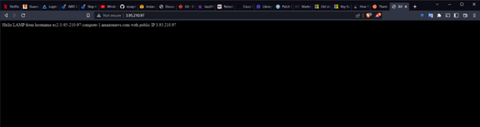

 

! Enable PHP on the website
! Change pattern of precedence between the inex.php file and index.html file
sudo vim /etc/apache2/mods-enabled/dir.conf
[
<IfModule mod_dir.c>
        #Change this:
        #DirectoryIndex index.html index.cgi index.pl index.php index.xhtml index.htm
        #To this:
        DirectoryIndex index.php index.html index.cgi index.pl index.xhtml index.htm
</IfModule>
]
sudo systemctl reload apache2

! create PHP test script with the text below
[
<?php
phpinfo();
]
vim /var/www/projectlamp/index.php

! refresh page

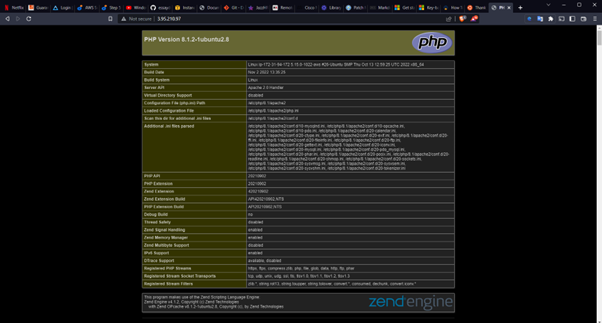
 
!Remove index.php file
sudo rm /var/www/projectlamp/index.php

! refresh page
